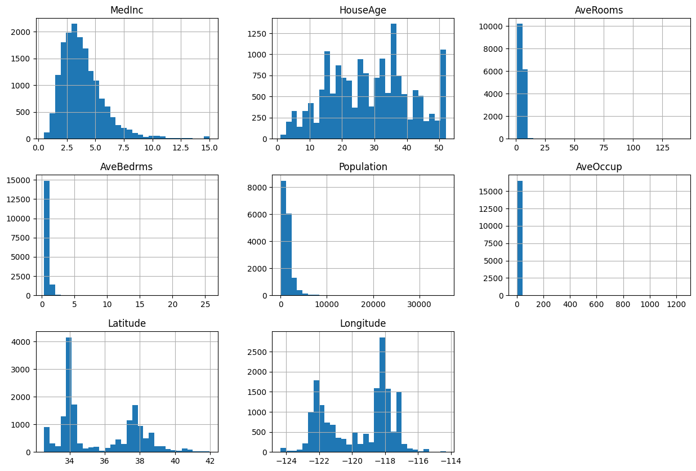
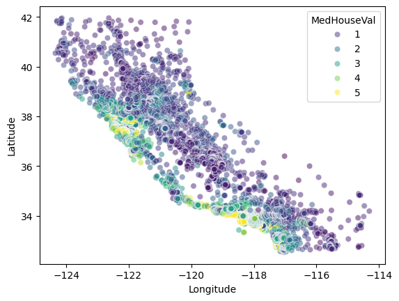
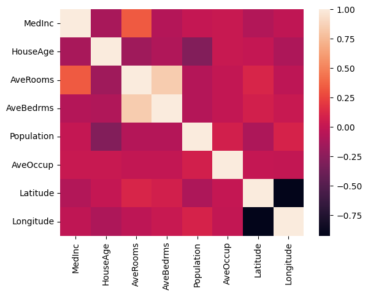
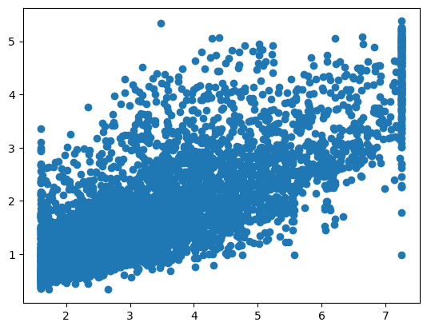
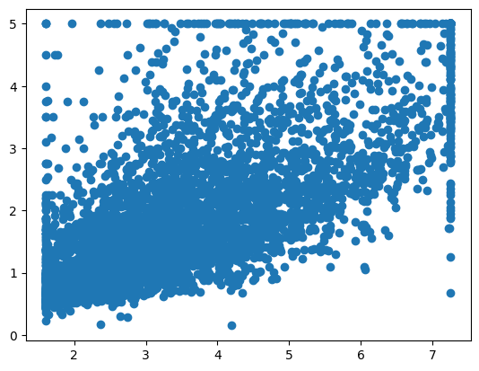

# Predicting Housing Prices in California: A Machine Learning Journey

Predicting housing prices is a classic problem in machine learning, offering insights into real estate markets and showcasing the power of various regression techniques. In this blog post, we'll walk through a California housing price prediction project, exploring data preprocessing, feature engineering, and model selection to achieve the best possible predictions.

## 1\. Setting the Stage: Importing Libraries and Loading Data

Our journey begins by importing essential Python libraries for data manipulation, machine learning, and visualization: `numpy`, `pandas`, `sklearn.datasets`, `sklearn.model_selection`, and `seaborn`.

We then load the California housing dataset, conveniently available through `sklearn.datasets.fetch_california_housing()`. This dataset contains various features about California districts and their median house values.

```python
import numpy as np
from sklearn.datasets import fetch_california_housing
import pandas as pd
from sklearn.model_selection import train_test_split
import seaborn as sns

california_housing = fetch_california_housing()
df = pd.DataFrame.from_records(california_housing.data, columns=california_housing.feature_names)
y = california_housing.target
df[california_housing.target_names[0]] = california_housing.target
```

## 2\. Splitting the Dataset: Training and Testing

To evaluate our models effectively, we split our data into training and testing sets. The training set will be used to teach the model, and the unseen testing set will be used to assess its performance. We reserve 20% of the data for testing and set a `random_state` for reproducibility.

```python
X_train, X_test, y_train, y_test = train_test_split(df.drop('MedHouseVal', axis=1), df['MedHouseVal'], test_size=0.2, random_state=42)
print(X_train.shape)
print(y_train.shape)
```

Output:

```
(16512, 8)
(16512,)
```

```python
df_train = pd.DataFrame(data=X_train, columns=california_housing.feature_names)
df_test = pd.DataFrame(data=X_test, columns=california_housing.feature_names)
```

## 3\. Understanding the Data: Distribution and Correlation

Before building models, it's crucial to understand our data. We visualize the distribution of features in the training data using histograms and examine the correlation matrix.

```python
df_train.hist(bins=30, figsize=(15, 10))
```

Output:

```
array([[<Axes: title={'center': 'MedInc'}>,
        <Axes: title={'center': 'HouseAge'}>,
        <Axes: title={'center': 'AveRooms'}>],
       [<Axes: title={'center': 'AveBedrms'}>,
        <Axes: title={'center': 'Population'}>,
        <Axes: title={'center': 'AveOccup'}>],
       [<Axes: title={'center': 'Latitude'}>,
        <Axes: title={'center': 'Longitude'}>, <Axes: >]], dtype=object)

```


```python
sns.scatterplot(data=df, x="Longitude", y="Latitude", hue='MedHouseVal', alpha=0.5, palette='viridis')
```

Output:

```
<Axes: xlabel='Longitude', ylabel='Latitude'>

(Image of Scatter Plot)
```


The correlation matrix reveals relationships between features. For instance, 'HouseAge' and 'MedInc' have a correlation value of -0.12, indicating that areas with higher median incomes tend to have newer houses.

```python
print(df_train.corr())
```

Output:

```
              MedInc  HouseAge  AveRooms  AveBedrms  Population  AveOccup  \
MedInc      1.000000 -0.121711  0.336013  -0.072550    0.004122  0.022061   
HouseAge   -0.121711  1.000000 -0.160892  -0.087983   -0.292283  0.016245   
AveRooms    0.336013 -0.160892  1.000000   0.836163   -0.073733 -0.004922   
AveBedrms  -0.072550 -0.087983  0.836163   1.000000   -0.071267 -0.006035   
Population  0.004122 -0.292283 -0.073733  -0.071267    1.000000  0.072330   
AveOccup    0.022061  0.016245 -0.004922  -0.006035    0.072330  1.000000   
Latitude   -0.076571  0.005296  0.110695   0.073161   -0.102499  0.005837   
Longitude  -0.017040 -0.101818 -0.029339   0.016647    0.094276 -0.000598   

            Latitude  Longitude  
MedInc     -0.076571  -0.017040  
HouseAge    0.005296  -0.101818  
AveRooms    0.110695  -0.029339  
AveBedrms   0.073161   0.016647  
Population -0.102499   0.094276  
AveOccup    0.005837  -0.000598  
Latitude    1.000000  -0.924485  
Longitude  -0.924485   1.000000  
```

```python
sns.heatmap(df_train.corr())
```

Output:

```
<Axes: >

(Image of Heatmap)
```


## 4\. Handling Outliers: A Crucial Step for Robust Models

Let's check for outliers in the training data. The `describe()` function provides various statistical insights into our training data. It reveals a significant difference between the 75th percentile and the maximum values for 'Population', 'MedInc', 'AveRooms', 'AveBedrms', and 'AveOccup'. Linear regression models are highly sensitive to outliers, which can degrade their performance.

To address this, we'll implement a clipping strategy. We will use the 95th percentile as the upper limit and the 5th percentile as the lower limit. Typical percentile values used for clipping include 99-1, 95-5, and 90-10.

```python
df_train.describe()
```

Output:

```
             MedInc      HouseAge      AveRooms     AveBedrms    Population  \
count  16512.000000  16512.000000  16512.000000  16512.000000  16512.000000   
mean       3.880754     28.608285      5.435235      1.096685   1426.453004   
std        1.904294     12.602499      2.387375      0.433215   1137.056380   
min        0.499900      1.000000      0.888889      0.333333      3.000000   
25%        2.566700     18.000000      4.452055      1.006508    789.000000   
50%        3.545800     29.000000      5.235874      1.049286   1167.000000   
75%        4.773175     37.000000      6.061037      1.100348   1726.000000   
max       15.000100     52.000000    141.909091     25.636364  35682.000000   

           AveOccup      Latitude     Longitude  
count  16512.000000  16512.000000  16512.000000  
mean       3.096961     35.643149   -119.582290  
std       11.578744      2.136665      2.005654  
min        0.692308     32.550000   -124.350000  
25%        2.428799     33.930000   -121.810000  
50%        2.817240     34.260000   -118.510000  
75%        3.280000     37.000000   -118.010000  
max     1243.333333     41.950000   -114.310000  
```

```python
def clip_outlier(df, features):
    for feature in features:
        upper_limit = df[feature].quantile(0.95)
        lower_limit = df[feature].quantile(0.05)
        df[f'{feature}_capped_quantile'] = np.where(
            df[feature] > upper_limit,
            upper_limit, # If value is greater than upper limit, set to upper limit
            np.where(
                df[feature] < lower_limit,
                lower_limit, # If value is less than lower limit, set to lower limit
                df[feature] # Otherwise, keep the original value
            )
        )
```

Outliers have been clipped from both the training and testing data.

```python
clip_features = ['Population', 'MedInc', 'AveRooms', 'AveBedrms', 'AveOccup']
clip_outlier(df_train, clip_features)
clip_outlier(df_test, clip_features)
```

```python
df_train.describe()
```

Output:

```
             MedInc      HouseAge      AveRooms     AveBedrms    Population  
count  16512.000000  16512.000000  16512.000000  16512.000000  16512.000000   
mean       3.880754     28.608285      5.435235      1.096685   1426.453004   
std        1.904294     12.602499      2.387375      0.433215   1137.056380   
min        0.499900      1.000000      0.888889      0.333333      3.000000   
25%        2.566700     18.000000      4.452055      1.006508    789.000000   
50%        3.545800     29.000000      5.235874      1.049286   1167.000000   
75%        4.773175     37.000000      6.061037      1.100348   1726.000000   
max       15.000100     52.000000    141.909091     25.636364  35682.000000   

           AveOccup      Latitude     Longitude  Population_capped_quantile  
count  16512.000000  16512.000000  16512.000000                16512.000000   
mean       3.096961     35.643149   -119.582290                 1353.717581   
std       11.578744      2.136665      2.005654                  773.655357   
min        0.692308     32.550000   -124.350000                  349.000000   
25%        2.428799     33.930000   -121.810000                  789.000000   
50%        2.817240     34.260000   -118.510000                 1167.000000   
75%        3.280000     37.720000   -118.010000                 1726.000000   
max     1243.333333     41.950000   -114.310000                 3282.450000   

       MedInc_capped_quantile  AveRooms_capped_quantile  
count            16512.000000              16512.000000   
mean                 3.797838                  5.309239   
std                  1.568423                  1.135154   
min                  1.599460                  3.438549   
25%                  2.566700                  4.452055   
50%                  3.545800                  5.235874   
75%                  4.773175                  6.061037   
max                  7.310800                  7.645946   

       AveBedrms_capped_quantile  AveOccup_capped_quantile  
count               16512.000000              16512.000000  
mean                    1.062225                  2.898540  
std                     0.082516                  0.651649  
min                     0.939394                  1.872511  
25%                     1.006508                  2.428799  
50%                     1.049286                  2.817240  
75%                     1.100348                  3.280000  
max                     1.276685                  4.333333  
```

## 5\. Feature Engineering: Creating More Informative Variables

To enhance our model's understanding of the data, we'll engineer two more features in the datasets:

1.  The ratio of the number of bedrooms to the total number of rooms in the house.
2.  The number of rooms per occupancy, which represents the rooms per person in the house.

Let's examine their correlation with the target variable.

```python
print(np.corrcoef(df_train['AveBedrms'] / df_train['AveRooms'], y_train))
print(np.corrcoef(df_train['AveRooms'] / df_train['AveOccup'] , y_train))
print(np.corrcoef(df_train['Longitude'], y_train))
print(np.corrcoef(df_train['Latitude'], y_train))
```

Output:

```
[[ 1.         -0.25741882]
 [-0.25741882  1.        ]]
[[ 1.         -0.03115971]
 [-0.03115971  1.        ]]
[[ 1.         -0.04634888]
 [-0.04634888  1.        ]]
[[ 1.         -0.14298335]
 [-0.14298335  1.        ]]
```

We then add them to both our training and testing dataframes.

```python
df_train['AveBedrms_AveRooms_ratio'] = df_train['AveBedrms_capped_quantile'] / df_train['AveRooms_capped_quantile']
df_train['AveRooms_AveOccup_ratio'] = df_train['AveRooms_capped_quantile'] / df_train['AveOccup_capped_quantile']

df_test['AveBedrms_AveRooms_ratio'] = df_test['AveBedrms_capped_quantile'] / df_test['AveRooms_capped_quantile']
df_test['AveRooms_AveOccup_ratio'] = df_test['AveRooms_capped_quantile'] / df_test['AveOccup_capped_quantile']
```

```python
df_train.columns
```

Output:

```
Index(['MedInc', 'HouseAge', 'AveRooms', 'AveBedrms', 'Population', 'AveOccup',
       'Latitude', 'Longitude', 'Population_capped_quantile',
       'MedInc_capped_quantile', 'AveRooms_capped_quantile',
       'AveBedrms_capped_quantile', 'AveOccup_capped_quantile',
       'AveBedrms_AveRooms_ratio', 'AveRooms_AveOccup_ratio'],
      dtype='object')
```

We select the relevant features, including our newly engineered ones and the capped original features, to form our final `X_train` and `X_test` datasets.

```python
features = ['MedInc_capped_quantile', 'Latitude', 'Longitude', 'AveBedrms_AveRooms_ratio', 'AveRooms_AveOccup_ratio', 'HouseAge', 'Population_capped_quantile']
X_train = df_train[features].values
X_test = df_test[features].values
```

## 6\. Feature Scaling: Normalizing for Better Model Performance

Before applying regression models to the data, it's crucial to perform feature scaling. Linear regression is highly sensitive to the range of features. If a feature has a high magnitude, the model might incorrectly consider it more important and increase its weight during training, potentially leading to the discovery of non-existent patterns and overfitting against a few parameters. Therefore, it is important to bring the magnitudes of all parameters to a similar level through feature scaling. We've employed `StandardScaler` for this purpose. It's worth noting that decision trees are insensitive to the scale of features because they determine splits based on impurity or entropy. They achieve this by comparing values within the same feature column and selecting splits that minimize impurity or entropy, making them independent of the overall scale of the feature.

```python
from sklearn.preprocessing import StandardScaler
scaler = StandardScaler()
# Corrected: Use fit_transform on X_train and transform on X_test
X_train_scaled = scaler.fit_transform(X_train)
X_test_scaled = scaler.transform(X_test)
```

Output:

```
StandardScaler()
```

## 7\. Model Training and Evaluation

Now, we'll train and evaluate several regression models, assessing their performance using metrics like Mean Absolute Error (MAE), Mean Squared Error (MSE), and R-squared ($R^2$). A higher R-squared value indicates a better fit of the model to the data.

### a. Linear Regression

Linear Regression is a fundamental algorithm for predicting continuous target variables.

```python
from sklearn.linear_model import LinearRegression
from sklearn.metrics import mean_absolute_error, mean_squared_error, r2_score

regressor = LinearRegression(fit_intercept=True,)
regressor.fit(X_train_scaled, y_train) # Use scaled training data
predictions = regressor.predict(X_test_scaled) # Use scaled testing data

print(mean_absolute_error(y_test, predictions))
print(mean_squared_error(y_test, predictions))
print(r2_score(y_test, predictions))
```

Output:

```
0.4897401032906702
0.4459624822936078
0.6596768721073093
```

Linear Regression achieved an R-squared score of approximately 0.66.

### b. Decision Tree Regressor

Decision Trees are versatile and can capture non-linear relationships. We use `GridSearchCV` to find the optimal hyperparameters for our Decision Tree Regressor.

```python
from sklearn.tree import DecisionTreeRegressor
from sklearn.model_selection import GridSearchCV
from sklearn.metrics import mean_absolute_error, mean_squared_error, r2_score

parameters = {
    "max_depth": [3, 5, 10],
    "min_samples_split": [2, 5, 10],
    "min_samples_leaf": [1, 2, 3, 4, 5]
}

regressor = DecisionTreeRegressor(random_state=42)
grid_search = GridSearchCV(regressor, parameters)
grid_search.fit(X_train_scaled, y_train) # Use scaled training data

print(grid_search.best_params_)
estimator = grid_search.best_estimator_
predictions = estimator.predict(X_test_scaled) # Use scaled testing data

print(mean_absolute_error(y_test, predictions))
print(mean_squared_error(y_test, predictions))
print(r2_score(y_test, predictions))
```

Output:

```
{'max_depth': 10, 'min_samples_leaf': 5, 'min_samples_split': 2}
0.43189922182861074
0.41212809475113166
0.6854965880160752
```

The Decision Tree Regressor, with optimized hyperparameters, yielded an R-squared score of approximately 0.68.

### c. Random Forest Regressor

Random Forests, an ensemble of Decision Trees, often provide improved accuracy and robustness. Again, we use `GridSearchCV` for hyperparameter tuning.

```python
from sklearn.ensemble import RandomForestRegressor
from sklearn.model_selection import GridSearchCV
from sklearn.metrics import mean_absolute_error, mean_squared_error, r2_score

parameters = {
    "max_depth": [3, 5, 10],
    "min_samples_split": [2, 5, 10],
    "min_samples_leaf": [1, 2, 5]
}

regressor = RandomForestRegressor(random_state=42, n_jobs=-1, n_estimators=100)
grid_search = GridSearchCV(regressor, parameters)
grid_search.fit(X_train_scaled, y_train) # Use scaled training data

print(grid_search.best_params_)
estimator = grid_search.best_estimator_
predictions = estimator.predict(X_test_scaled) # Use scaled testing data

print(mean_absolute_error(y_test, predictions))
print(mean_squared_error(y_test, predictions))
print(r2_score(y_test, predictions))
```

Output:

```
{'max_depth': 10, 'min_samples_leaf': 2, 'min_samples_split': 2}
0.38452772996033857
0.32273071015358695
0.7537175679406422
```

The Random Forest Regressor achieved a respectable R-squared score of approximately 0.75.

### d. XGBoost Regressor

XGBoost is a powerful gradient boosting framework known for its high performance in many machine learning tasks.

```python
from xgboost import XGBRegressor
from sklearn.metrics import mean_absolute_error, mean_squared_error, r2_score

regressor = XGBRegressor()
regressor.fit(X_train_scaled, y_train) # Use scaled training data
predictions = regressor.predict(X_test_scaled) # Use scaled testing data

print(mean_absolute_error(y_test, predictions))
print(mean_squared_error(y_test, predictions))
print(r2_score(y_test, predictions))
```

Output:

```
0.307848461431221
0.2180799337088517
0.8335787244058696
```

The XGBoost Regressor delivered the best performance, with an impressive R-squared ($R^2$) score of 0.83.

## 8\. Visualizing Predictions

Finally, we visualize the predictions from our best model against the actual values using a scatter plot.

```python
import matplotlib.pyplot as plt
plt.scatter(X_test_scaled[:, 0], predictions) # Use scaled data for plotting if model was trained on scaled data
plt.show()
```

Output:


````
```python
import matplotlib.pyplot as plt
plt.scatter(X_test_scaled[:, 0], y_test) # Use scaled data for plotting if model was trained on scaled data
plt.show()
````

Output:


```
The scatter plot of predictions versus actual values clearly shows points lying close to a 45-degree line, confirming the strong performance of our XGBoost model.

-----
